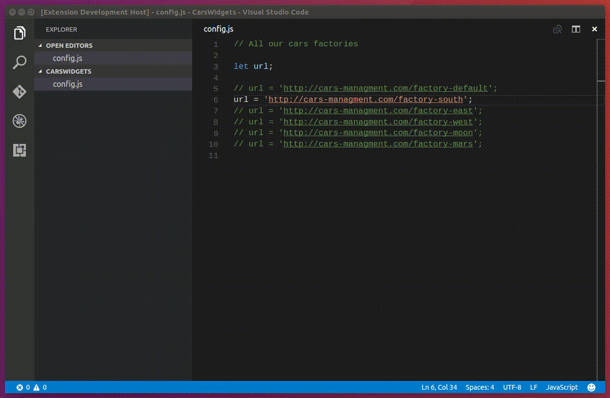

# VSCode "SwitchLine" Extension

This is VS Code extension. It helps to switch between multiply commented lines of a certain file. 

## Features

Here you can see what this extension actually does. For example you have many urls from which you can get info about the cars. But you should use only one of them. And you always need to switch between them. So, this extension is a solution!

```javascript
// All our cars factories 

let url;

url = 'http://cars-managment.com/factory-default';
// url = 'http://cars-managment.com/factory-south';
// url = 'http://cars-managment.com/factory-east';
// url = 'http://cars-managment.com/factory-west';
// url = 'http://cars-managment.com/factory-moon';
// url = 'http://cars-managment.com/factory-mars';
```

Here is a gif about how it works.



## Install

You can install this extension via `ext install switchLine`

## Usage

1. Setup your config file as described at [Extension Settings Section](#extSettings) 
2. Open Command Palette and search for `Switch Line` extension, then press `Enter`.
3. You will see a selection list, that contains lines data, that you configured.
4. Choose data that you need to turn on and wait for succesfull info message.

## <a name="extSettings"></a>Extension Settings

This extension contributes the following settings:

* `switchLine.path`: path to your file with commented lines
    * default: `/config.js`
* `switchLine.matchLineRule`: regexp to recognize lines you want to switch
    * default: `url = '.+'`
* `switchLine.matchDataRule`: regexp to match useful data in line
    * default: `'.+'`

## Release Notes

### 0.0.1

Initial release of SwitchLine, contains only basic functionality:

* setup config file
* switch between commented lines